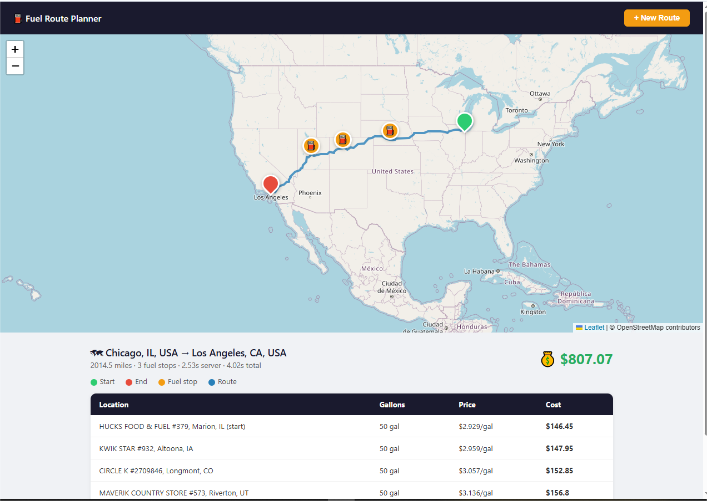

# Fuel Route Planner

A Django REST API that calculates the optimal (most cost-effective) fuel stops along a driving route within the USA.

## Preview



## What it does

Given a start and end location, the API returns:
- The full driving route
- Optimal fuel stops every 500 miles, picking the cheapest station in each state
- Total fuel cost assuming 10 MPG and a 500-mile tank range
- An interactive map with pins for start, end, and each fuel stop

## Tech stack

- **Django 6** + **Django REST Framework** — API + template serving
- **OpenRouteService API** — routing and geocoding (3 calls per request)
- **SQLite** — fuel station data (6,952 stations across 57 states)
- **Leaflet.js** — interactive map rendered in the browser
- **Offline state lookup** — bounding box dict for coordinate → state, zero extra API calls

## Architecture

Clean layered architecture:
```
domain/          → Route, FuelStop dataclasses — pure Python, no Django
application/     → RouteService, PlanRouteCommand — orchestrates the logic
infrastructure/  → ORS client, fuel repository, offline state lookup
presentation/    → DRF view, serializer, URLs
templates/       → Leaflet map UI
```

## Setup

**1. Clone and create virtual environment**
```bash
git clone <repo>
cd fuel-route
python -m venv venv
source venv/bin/activate
```

**2. Install dependencies**
```bash
pip install -r requirements.txt
```

**3. Configure environment**
```bash
cp .env.example .env
# Add your OpenRouteService API key — free at openrouteservice.org
```

**4. Run migrations and load fuel data**
```bash
python manage.py migrate
python manage.py load_fuel_data
```

**5. Start the server**
```bash
python manage.py runserver
```

**6. Open the UI**
```
http://localhost:8000
```

## API

### `POST /route/`

**Request:**
```json
{
    "start": "Chicago, IL",
    "end": "Los Angeles, CA"
}
```

**Response:**
```json
{
    "start": "Chicago, IL, USA",
    "end": "Los Angeles, CA, USA",
    "total_miles": 2014.5,
    "total_cost": 799.07,
    "fuel_stops": [
        {
            "miles_into_route": 500.2,
            "state": "NE",
            "station_name": "AKAL TRAVEL CENTER",
            "city": "Waco",
            "price_per_gallon": 2.799
        }
    ],
    "cost_breakdown": [
        {
            "at": "AKAL TRAVEL CENTER, Waco, NE",
            "gallons": 50.0,
            "price_per_gallon": 2.799,
            "cost": 139.95
        }
    ],
    "geometry": {
        "type": "LineString",
        "coordinates": [...]
    },
    "meta": {
        "elapsed_seconds": 2.1,
        "api_calls": 3
    }
}
```

## Data

Fuel prices sourced from OPIS truckstop data — 8,151 raw records deduplicated to 6,952 unique stations. Loaded once into SQLite via:
```bash
python manage.py load_fuel_data
```

## Assumptions

- Vehicle max range: **500 miles**
- Vehicle fuel efficiency: **10 MPG**
- Tank size: **50 gallons** (500 miles ÷ 10 MPG)
- Optimal = cheapest available station in the state at each 500-mile interval
- Routes within the USA only

## Notes

- The UI is served at `GET /route/` — open it in a browser for a visual demo
- API calls: 2x ORS geocode + 1x ORS directions = 3 total per request
- State lookup is fully offline (bounding box dict) — no extra API calls
